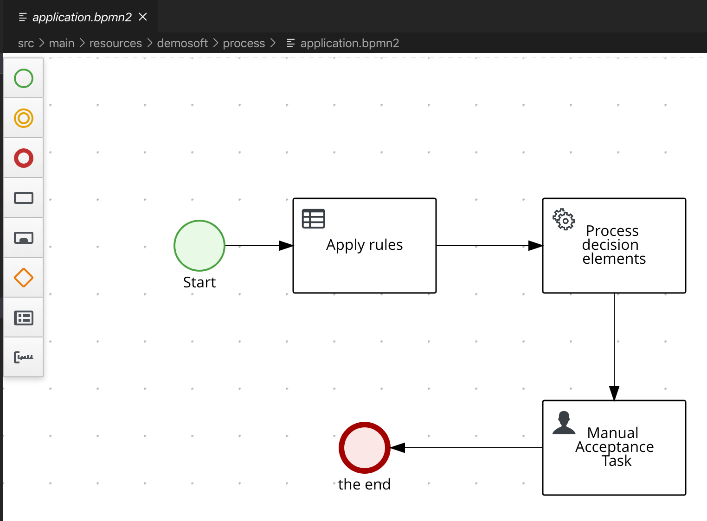

# Housing Benefit Calculation using Kogito

Showcases housing benefit calculation using Kogita BPMN and Rule Engine.

Idea taken from https://github.com/rikusarlin/DroolsHousingBenefit

## Changes made to https://github.com/rikusarlin/DroolsHousingBenefit

- BigDecimals replaced with doubles (makes DRL selectors easier, for example ```Foo(amount > 0)```)
- No rule groups used
- As much as possible done using DRL, so POJOs have no rule logic.

## Swagger UI

http://localhost:8080/swagger-ui

### Process description

Process is a very simple one. POJO [BenefitApplication.java](src/main/java/demosoft/domain/BenefitApplication.java) is gotten in via REST API.
In the first process step "Apply Rules" rules from [benefits.drl](src/main/resources/demosoft/rules/benefits.drl) and [Excel sheet](src/main/resources/demosoft/rules/max_costs.xlsx) are run.
After that step localization using resource bundles is done and then there is a manual acceptance step in the process. 



Note: you can edit the process diagram using VS Code extension called 'Kogito Bundle'

## Running the application in dev mode

You can run your application in dev mode that enables live coding using:
```
mvn quarkus:dev
```

## Testing application

See `bin` directory.

## Packaging and running the application

The application can be packaged using `mvn package`.
It produces the `benefitapp-1.0-SNAPSHOT-runner.jar` file in the `/target` directory.
Be aware that it’s not an _über-jar_ as the dependencies are copied into the `target/lib` directory.

The application is now runnable using `java -jar target/benefitapp-1.0-SNAPSHOT-runner.jar`.

## Creating a native executable

You can create a native executable using: `mvn package -Pnative`.

Or, if you don't have GraalVM installed, you can run the native executable build in a container using: `mvn package -Pnative -Dquarkus.native.container-build=true`.

You can then execute your native executable with: `./target/benefitapp-1.0-SNAPSHOT-runner -Dquarkus.http.host=127.0.0.1`

If you want to learn more about building native executables, please consult https://quarkus.io/guides/building-native-image.

##  Deployment to OpenShift 
Login to OpenShift

Create a new project
```
oc new-project benefitapplication
```

Create a build

```
oc new-build --name=benefit java:11 --binary=true
```

Start the build

```
oc start-build benefit --from-dir target --follow
```

After build has been finished, create an application using it:

```
oc new-app benefit -e JAVA_OPTIONS=-Dquarkus.http.host=0.0.0.0 -e JAVA_APP_JAR=benefitapp-1.0-SNAPSHOT-runner.jar
```

Expose the route

```
oc expose svc/benefit
```

Try it out
```
bin/ocp-send-1.sh
```

## Known issues

### Message bundles with native compilation

Example project demonstrating this https://github.com/tfriman/quarkus-native-resourcebundle This issue is possibly related to this https://github.com/oracle/graal/issues/911

### Debug print statements in DRL

These are not along the best practises but they make it easy to demonstrate quarkus:dev mode when you just change the debug function in DRL file.